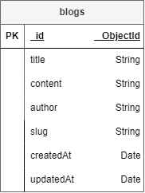

<h1>MERN Workshop Server</h1>
<p>Server is API service system for blog post projects made by NodeJS, Express, MongoDB Atlas</p>

<h2>Required</h2>
<ul>
    <li><a href="https://nodejs.org/en/blog/release/v14.18.1">Node.js version 14.18.1</a></li>
</ul>

<h2>Tools</h2>
<ul>
    <li><a href="https://code.visualstudio.com/">Vscode</a></li>
    <li><a href="https://www.postman.com/">Postman</a></li>
    <li><a href="https://devcenter.heroku.com/articles/heroku-cli">Heroku CLI</a></li>
    <li><a href="https://www.mongodb.com/">MongoDB Atlas</a></li>
</ul>

<h2>Packages</h2>

```bash
npm install express jsonwebtoken cors nodemon dotenv slugify express-jwt morgan uuid
npm install mongoose@6.12.3
```

<h2>Database Schema</h2>
</img>

<h2>.env Example</h2>

```bash
NAME=
VERSION=

PORT=
DATABASE=

JWT_SECRET_KEY=

USERNAME1=
PASSWORD=
```

<h2>Postman</h2>
<ul>
    <li><a href="./MERN-Workshop.postman_collection.json">Collection</a></li>
    <li><a href="./MERN-Workshop-dev.postman_environment.json">Environment</a></li>
</ul>

<h2>Deploy Client to Heroku</h2>
<p>1. Create a Procfile file in the root directory and copy the command below.</p>

```bash
web:node server.js
```

<p>2. Set Config Vars (Environment app) on Heroku</p>
<p>3. Deploy using Heroku Git</p>
